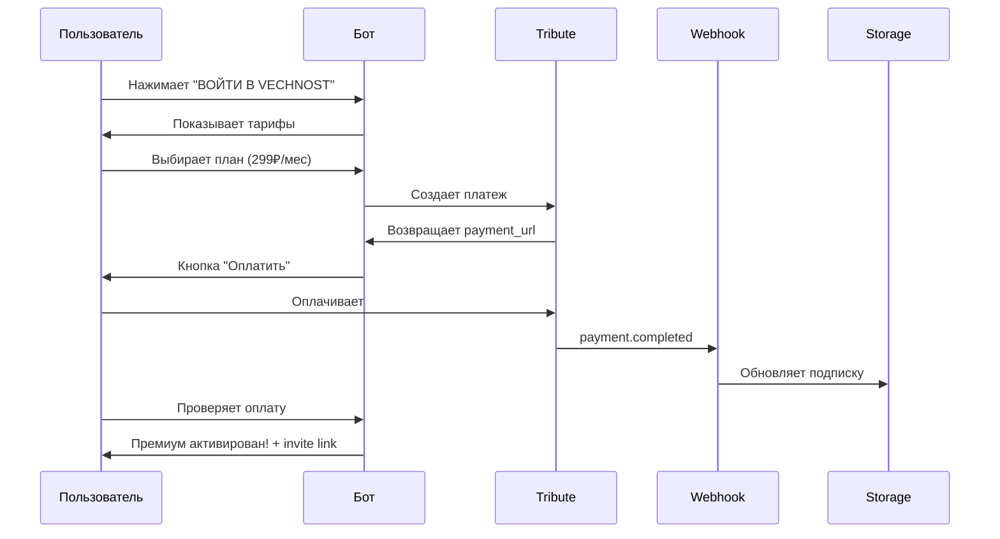

# 💎 Система оплаты Vechnost - Итоговое резюме

## ✅ Что реализовано

### 1. 🏗️ Архитектура системы

#### Созданные файлы:
```
vechnost_bot/
├── payment_models.py          ✅ Модели: SubscriptionTier, UserSubscription, PaymentTransaction
├── payment_keyboards.py       ✅ Клавиатуры: welcome screen, subscription, payment
├── payment_handlers.py        ✅ Обработчики платежных действий
├── subscription_storage.py    ✅ Хранилище подписок в Redis
├── subscription_middleware.py ✅ Middleware для проверки доступа
├── tribute_client.py          ✅ Клиент Tribute API
└── payment_webhook.py         ✅ Webhook обработчик от Tribute
```

#### Обновленные файлы:
```
├── config.py                  ✅ Добавлены настройки Tribute и премиум канала
├── handlers.py                ✅ Обновлен /start для welcome screen
├── callback_handlers.py       ✅ Интегрированы payment handlers
├── callback_models.py         ✅ Добавлены payment callback actions
├── env.example                ✅ Добавлены переменные окружения
└── data/translations_ru.yaml  ✅ Переводы для платежной системы
```

---

## 🎨 Дизайн интерфейса

### Welcome Screen (как у ХЛБ)

```
┌─────────────────────────────────┐
│  [Фото лого Vechnost]           │
│                                  │
│  VECHNOST — игра для пар 💕     │
│                                  │
│  Углубите отношения через       │
│  осознанные разговоры           │
│                                  │
│  📱 14,458 пользователей        │
│                                  │
│  [ВОЙТИ В VECHNOST ←]           │
│  [ЧТО ТЕБЯ ЖДЁТ ВНУТРИ?]        │
│  [ПОЧЕМУ VECHNOST ПОМОЖЕТ?]     │
│  [ОТЗЫВЫ О VECHNOST]            │
│  [ГАРАНТИЯ]                     │
│  [💬 Связаться с автором]       │
└─────────────────────────────────┘
```

### Информационные страницы

- **Что внутри**: Описание 4 колод, 500+ вопросов
- **Почему помогает**: Осознанные разговоры, безопасное пространство
- **Отзывы**: Отзывы реальных пользователей
- **Гарантия**: Конфиденциальность, возврат средств

---

## 💳 Тарифные планы

### 🆓 FREE
- **Цена**: Бесплатно
- **Темы**: Знакомство, Для Пар
- **Лимит**: 10 вопросов/день
- **Канал**: ❌
- **Поддержка**: Базовая

### ⭐ PREMIUM
- **Цена**: 299₽/мес или 2990₽/год
- **Темы**: Все (+ Секс, Провокация)
- **Лимит**: Неограничено
- **Канал**: ✅ Эксклюзивный
- **Поддержка**: Приоритетная
- **Бонусы**: Персональные фоны

---

## 🔄 Процесс покупки



---

## 🛡️ Безопасность

### Реализовано:
- ✅ Проверка webhook подписи HMAC-SHA256
- ✅ Валидация callback data
- ✅ Rate limiting для бесплатных пользователей
- ✅ Защита премиум контента middleware
- ✅ Автоматическая деактивация истекших подписок

### Данные в Redis:
```
subscription:{user_id}  # Данные подписки
payment:{txn_id}        # История платежей
user_payments:{user_id} # Список платежей пользователя
```

---

## 🔌 Интеграция с Tribute

### Реализованные методы:

```python
# Создание платежа
payment_link = await tribute.create_payment_link(
    amount=299.0,
    currency="RUB",
    description="Vechnost Premium",
    user_id=user_id
)

# Проверка статуса
status = await tribute.get_payment_status(payment_id)

# Webhook обработка
event = await tribute.process_webhook_event(payload)
```

### Webhook events:
- `payment.completed` - Платеж успешен → активация премиума
- `payment.failed` - Платеж не прошел → уведомление
- `subscription.renewed` - Автопродление → продление на 30 дней
- `subscription.cancelled` - Отмена → деактивация автопродления

---

## 📊 Система разграничения доступа

### Проверки в коде:

```python
# В QuestionHandler
has_access = await check_and_enforce_subscription(query, session, theme)
if not has_access:
    return  # Показывает upgrade prompt

# Инкремент счетчика для free users
await increment_question_count(user_id)
```

### Правила доступа:

| Контент | Free | Premium |
|---------|------|---------|
| Знакомство | ✅ | ✅ |
| Для Пар | ✅ | ✅ |
| Секс | ❌ | ✅ |
| Провокация | ❌ | ✅ |
| Премиум канал | ❌ | ✅ |
| Вопросов/день | 10 | ∞ |

---

## 🎯 Фичи

### Автоматизация:
- ✅ Автоматическая активация премиума после оплаты
- ✅ Автоматическая отправка invite в премиум канал
- ✅ Автопродление подписок через Tribute
- ✅ Автоматическая деактивация истекших подписок

### UX:
- ✅ Красивый welcome screen с логотипом
- ✅ Информационные страницы с подробным описанием
- ✅ Прогресс бар дней подписки
- ✅ Уведомления об истечении подписки
- ✅ Prompt для upgrade при попытке доступа к премиум контенту

### Admin:
- ✅ Логирование всех платежных событий
- ✅ Статистика платежей через Redis
- ✅ Мониторинг webhook событий

---

## 🚀 Deployment

### Переменные окружения:

```bash
# Tribute
TRIBUTE_API_KEY=***
TRIBUTE_API_SECRET=***
TRIBUTE_WEBHOOK_SECRET=***
TRIBUTE_BASE_URL=https://api.tribute.ru

# Premium Channel
PREMIUM_CHANNEL_ID=@vechnost_premium
PREMIUM_CHANNEL_INVITE_LINK=https://t.me/+***

# Contacts
AUTHOR_USERNAME=@your_username
SUPPORT_USERNAME=@support

# Feature flag
PAYMENT_ENABLED=true
```

### Checklist для запуска:

1. ✅ Зарегистрироваться в Tribute
2. ✅ Создать продукт "Vechnost Premium"
3. ✅ Получить API ключи
4. ✅ Создать приватный Telegram канал
5. ✅ Добавить бота как администратора канала
6. ✅ Создать invite link
7. ✅ Настроить webhook в Tribute
8. ✅ Заполнить переменные окружения
9. ✅ Запустить бота

---

## 📚 Документация

- **PAYMENT_INTEGRATION_GUIDE.md** - Полное руководство по интеграции
- **PAYMENT_QUICKSTART.md** - Быстрый старт за 5 минут
- **PAYMENT_SUMMARY.md** - Это резюме

---

## 🧪 Тестирование

### Для разработки без Tribute:

```bash
PAYMENT_ENABLED=false  # Все получают полный доступ
```

### Для тестирования с Tribute:

```bash
TRIBUTE_BASE_URL=https://sandbox.tribute.ru  # Тестовая среда
```

---

## 📈 Метрики

### События для мониторинга:
```python
- bot_started
- start_command
- payment_created
- payment_completed
- payment_failed
- subscription_upgraded
- subscription_renewed
- subscription_cancelled
```

### Дашборд в Sentry:
- Количество подписок
- Конверсия free → premium
- Средний чек
- Churn rate

---

## 🔮 Возможности расширения

### Легко добавить:
- 💎 VIP тариф (999₽/мес)
- 🎁 Промокоды и скидки
- 👥 Семейная подписка
- 🎨 Кастомные фоны
- 🤖 AI-советы
- 📊 Персональная статистика

### Готовая архитектура:
```python
# Добавить новый тариф
SubscriptionTier.VIP = "vip"

# Добавить новую фичу
class SubscriptionFeatures:
    ai_suggestions: bool = False
    custom_backgrounds: bool = False
```

---

## ✨ Highlights

### Сделано как у ХЛБ:
- ✅ Welcome screen с кнопками
- ✅ Информационные страницы
- ✅ Отзывы и гарантии
- ✅ Связь с автором
- ✅ Премиум канал

### Лучше чем у ХЛБ:
- ✅ Многоязычность (RU/EN/CS)
- ✅ Автоматический webhook
- ✅ Redis для масштабирования
- ✅ Structured logging
- ✅ Type safety (Pydantic)

---

## 🎉 Результат

### Что получил пользователь:
1. 🎨 Красивый интерфейс
2. 💳 Простая оплата
3. 📱 Автоматический доступ к премиум каналу
4. ⭐ Эксклюзивный контент
5. 💬 Прямой контакт с автором

### Что получил разработчик:
1. 🏗️ Масштабируемая архитектура
2. 🔌 Готовая интеграция с Tribute
3. 🛡️ Безопасная обработка платежей
4. 📊 Мониторинг и аналитика
5. 📚 Полная документация

---

**Система готова к production! 🚀**

Можно запускать и принимать платежи прямо сейчас!

**Сделано с ❤️ для Vechnost**

